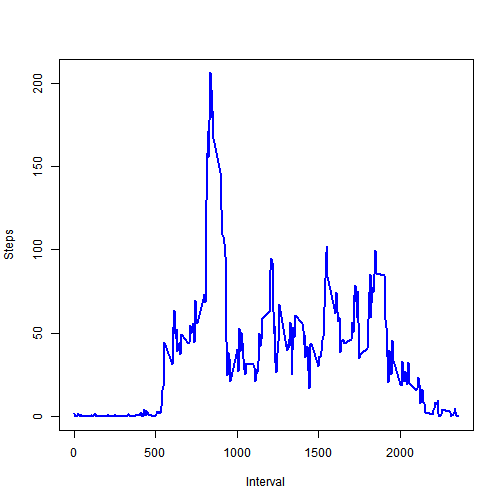
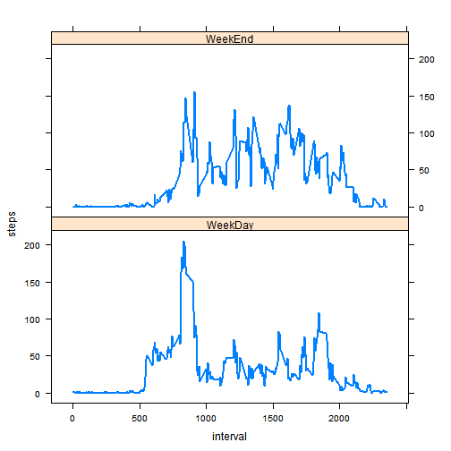

## Loading and preprocessing the data
This code assumes that the activity.csv file is present in the working directory

```r
inFile <- read.csv("activity.csv")
head(inFile)
```

```
##   steps       date interval
## 1    NA 2012-10-01        0
## 2    NA 2012-10-01        5
## 3    NA 2012-10-01       10
## 4    NA 2012-10-01       15
## 5    NA 2012-10-01       20
## 6    NA 2012-10-01       25
```

## What is mean total number of steps taken per day?
This code assumes that ggplot2 package is installed

```r
# Remove NA values
cleanFile <- na.omit(inFile)
# Aggregate steps per day
totalStepsPerDay <- aggregate(steps~date,cleanFile,sum)
head(totalStepsPerDay)
```

```
##         date steps
## 1 2012-10-02   126
## 2 2012-10-03 11352
## 3 2012-10-04 12116
## 4 2012-10-05 13294
## 5 2012-10-06 15420
## 6 2012-10-07 11015
```

```r
library(ggplot2)
# Histogram on the total steps per day
qplot(steps,data=totalStepsPerDay)
```

```
## stat_bin: binwidth defaulted to range/30. Use 'binwidth = x' to adjust this.
```

 

```r
# Mean of total steps per day
mean(totalStepsPerDay$steps)
```

```
## [1] 10766.19
```

```r
# Median of total steps per day
median(totalStepsPerDay$steps)
```

```
## [1] 10765
```

## What is the average daily activity pattern?

```r
averageStepsPerInterval <- aggregate(steps~interval,cleanFile,mean)
# Using the base plotting system for a change here
plot(averageStepsPerInterval$interval,
     averageStepsPerInterval$steps,
     type="l",col="blue",lwd=2,
     xlab="Interval",ylab="Steps")
```

 

```r
# Find the 5 minute interval which has the maximum number of Steps
averageStepsPerInterval[rev(order(averageStepsPerInterval$steps)),][1,]
```

```
##     interval    steps
## 104      835 206.1698
```
## Imputing missing values

```r
# Count the number of rows with missing values
sum(is.na(inFile))
```

```
## [1] 2304
```

To add missing values to the dataset, the strategy is to fill missing values with the median number of steps for that interval.  
This section requires the plyr package to be installed.  
[Inspiration](http://www.mail-archive.com/r-help@r-project.org/msg58289.html)

```r
library(plyr)
impute.median <- function(x) replace(x,is.na(x),median(x,na.rm = TRUE))
filledFile <- ddply(inFile,~interval,transform,steps = impute.median(steps))
#Check if the file is actually filled
sum(is.na(filledFile))
```

```
## [1] 0
```

```r
# Histogram on the total steps per day
totalStepsPerDayAfterFilling <- aggregate(steps~date,filledFile,sum)
qplot(steps,data=totalStepsPerDayAfterFilling)
```

```
## stat_bin: binwidth defaulted to range/30. Use 'binwidth = x' to adjust this.
```

 

```r
# Mean of total steps per day
mean(totalStepsPerDayAfterFilling$steps)
```

```
## [1] 9503.869
```

```r
# Median of total steps per day
median(totalStepsPerDayAfterFilling$steps)
```

```
## [1] 10395
```
### Impact of imputing to the total number of steps
*Though the total daily steps have increased after imputing, Mean and median have* **decreased** *when compared to the original values.*

## Are there differences in activity patterns between weekdays and weekends?
This section requires lattice library to be installed

```r
# First create the factor variable to identify the day type and add to the filledFile
filledFile$dayType <-factor(ifelse(as.POSIXlt(filledFile$date)$wday %in% c(0,6),'WeekEnd','WeekDay'))
#Check if it looks good
head(filledFile,10)
```

```
##    steps       date interval dayType
## 1      0 2012-10-01        0 WeekDay
## 2      0 2012-10-02        0 WeekDay
## 3      0 2012-10-03        0 WeekDay
## 4     47 2012-10-04        0 WeekDay
## 5      0 2012-10-05        0 WeekDay
## 6      0 2012-10-06        0 WeekEnd
## 7      0 2012-10-07        0 WeekEnd
## 8      0 2012-10-08        0 WeekDay
## 9      0 2012-10-09        0 WeekDay
## 10    34 2012-10-10        0 WeekDay
```

```r
# Now aggregate by interval and daytype
dayTypeAggregatedFile <- aggregate(steps~ interval + dayType,filledFile,mean)

# Panel plot for comparing the average number of steps taken between weekdays and weekends
library(lattice)
xyplot(steps~interval | dayType, 
       data = dayTypeAggregatedFile,
       layout = c(1,2),
       type="l",lwd=2)
```

 
